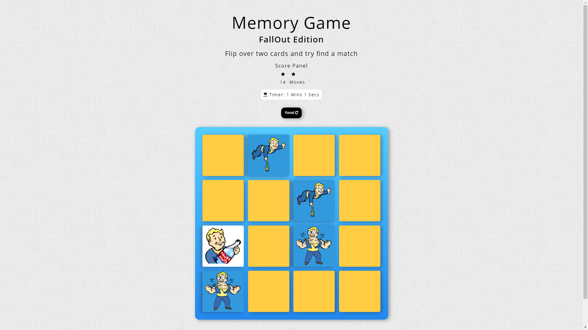
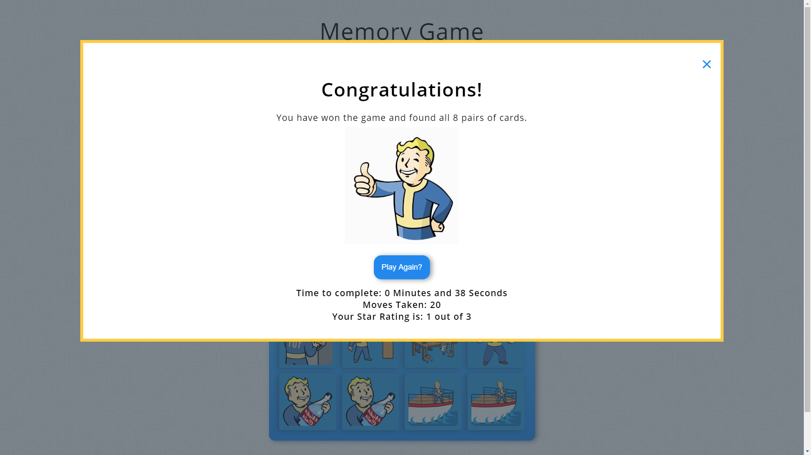

# Memory Game

Project 3 for Front End Nano Degree

This is a project from Udacity here is the [repo link](https://github.com/udacity/fend-project-memory-game)

## Licensing For Fallout Images

All Images are taken from [GamePedia Wiki Pages](http://fallout.wikia.com/wiki/Category:Vault_Boy_images) for the Fallout Games.  The images original source are created and owned by Bethesda Softworks.  The use of these images is believed to qualify as fair use for the purpose of creative work only.

### Screenshots of Working Game

## Project Specifications

### Game Behavior

* The game randomly shuffles the cards.  A user wins once all cards have successfully been matched.

* Congratulations Popup: When a user wins the game, a modal appears to congratulate the player and ask if they want to play again. It should also tell the user how much time it took to win the game, and what the star rating was.

* Restart Button: A restart button allows the player to reset the game board, the timer, and the star rating.

* Star Rating: The game displays a star rating (from 1-3) that reflects the player's performance. At the beginning of a game, it should display 3 stars. After some number of moves, it should change to a 2 star rating. After a few more moves, it should change to a 1 star rating.

The number of moves needed to change the rating is up to you, but it should happen at *some* point.

* Timer: When the player starts a game, a displayed timer should also start. Once the player wins the game, the timer stops.

* Move Counter: Game displays the current number of moves a user has made.

### Interface Design

* Styling: Application uses CSS to style components for the game.

* Usability: All application components are usable across modern desktop, tablet, and phone browsers.

### Documentation

* README: A `README` file is included detailing the game and all dependencies.

* Comments: Comments are present and effectively explain longer code procedure when necessary.

* Code Quality: Code is formatted with consistent, logical, and easy-to-read formatting as described in the Udacity JavaScript Style Guide.